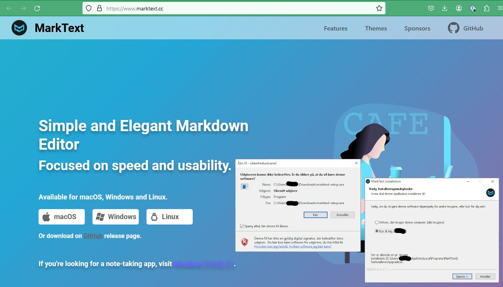
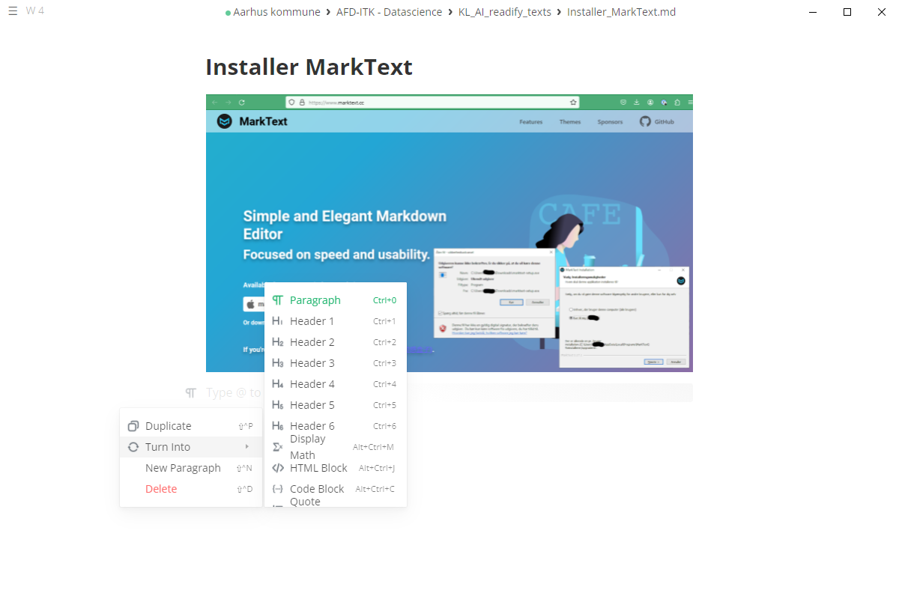
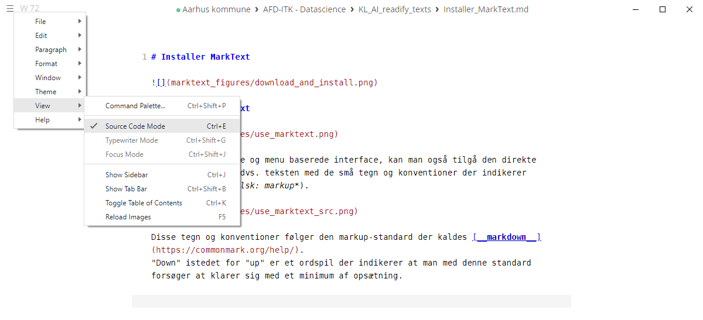

# Installer MarkText

# Skriv markdown med MarkText

Udover det grafiske og menu baserede interface, kan man også tilgå den direkte læsebare *kode* - dvs. teksten med de små tegn og konventioner der indikerer opsætningen (*engelsk: markup*). 

Disse tegn og konventioner følger den markup-standard der kaldes [__markdown__](https://commonmark.org/help/). 
"Down" istedet for "up" er et ordspil der indikerer at man med denne standard forsøger at klarer sig med et minimum af opsætning.

At kalde det en standard er dog en tilsnigelse, da der - måske på grund af simpliciteten, måske fordi forskellige brugere har haft forskellige traditioner - er flere variationer over markdown. De såkaldte *flavors*, alt efter hvor meget og hvilke opsætningskonventioner, der er tilladte:

- [CommonMark](https://commonmark.org/): Måske den simpleste version - kun indeholdende det de har vurderet er kerne opsætning for tekst dokumenter.

- [Github Flavored Markdown](https://github.github.com/gfm/): Måske den mest udbredte. 
  
  - [Githubs intro](https://docs.github.com/en/get-started/writing-on-github/getting-started-with-writing-and-formatting-on-github)

- [Pandoc Markdown](https://pandoc.org/MANUAL.html#pandocs-markdown): Den version [pandoc](https://pandoc.org) - et dokument konverteringsværktøj - bruger som standard
  
  Idet Pandoc er et værktøj til at konverterer mellem forskellige markup formater giver hjemmesiden et fint overblik over de forskellige formater man kan vælge at bruge.

- [MarkTexts markdown](https://github.com/marktext/marktext/blob/master/docs/MARKDOWN_SYNTAX.md): Den er jo også meget god at kende til, hvis man altså vil bruge MarkText :slightly_smiling_face:

Markdown er kendetegnet ved at opsætningen skal give mening når dokumentet læses uden rendering i et helt simpel fastbredde tekstredigeringsværktøj, f.eks. i det helt simple notesblok (notepad). Det er netop denne simplicitet, der gør det nemt for sprogmodeller at forstå indholdet.

# Metadata for dokumenter

For at knytte metadata, som f.eks. `forfatter`, `version`, `publiseringsdato` eller lignende, til dokumenter kan [YAML frontmatter](https://pandoc.org/MANUAL.html#extension-yaml_metadata_block) konventionen bruges.
